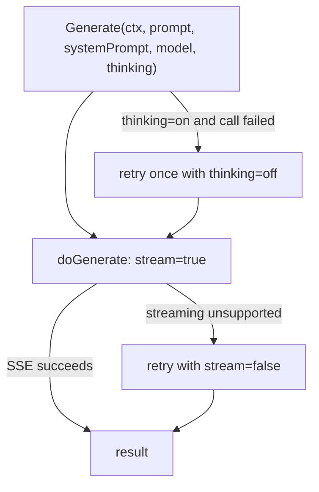

# API Client

Package: `client/`. Talks to any OpenAI-compatible
`/chat/completions` endpoint — that single endpoint is the entire
provider contract.

## Public surface

| Method | File | Job |
|---|---|---|
| `Client.Generate` | `client/api_call.go` | The only entry point: one chat completion with model + thinking params, fallbacks included |

Everything else (`doGenerate`, `doStreamedRequest`,
`doNonStreamedRequest`, `buildURL`, ...) is internal.

## Call flow — streaming first, two fallbacks



Reasons for each fallback:

- **Streaming first:** live output on long generations, and it detects
  "server hung" earlier. But not every OpenAI-compatible server
  supports `stream: true`, so the non-streamed retry keeps those
  working.
- **Thinking fallback:** extended thinking is exposed via
  `chat_template_kwargs` (a vLLM-style, non-standard field). If a
  server rejects it, the retry with thinking off means the user never
  sees a hard failure just because their model lacks the feature.

## Thinking mode — how it reaches the model

```go
chat_template_kwargs: { "enable_thinking": true }
```

Sent only when thinking is on. The field is a pointer with `omitempty`
so that when thinking is off the key is **absent from the JSON** —
strict providers reject unknown keys, and "send null" is not an option.

## Streaming wire format

SSE, one JSON event per line:

```
data: {"choices":[{"delta":{"content":"fe"}}]}
data: {"choices":[{"delta":{"content":"at:"}}]}
...
data: [DONE]
```

Implementation notes (`doStreamedRequest`):

- Non-`data:` lines (heartbeats, comments) are skipped.
- The scanner buffer is grown to 1 MB — a single long event can exceed
  bufio's 64 KB default and silently error otherwise.
- Malformed chunks are skipped, not fatal — one bad event should not
  discard a long generation.
- Deltas are appended in order to reconstruct the answer.

## URL normalization

`buildURL` makes `http://host:8000`, `http://host:8000/`,
`http://host:8000/v1`, and `http://host:8000/v1/` all work — users
write bases in all four forms, and the endpoint must end up at
`<base>/chat/completions`.

## Error diagnostics

On failure, `Generate` pattern-matches the error text to give targeted
hints (context-length exceeded, timeout, rate limit). The matching is
deliberately loose: providers share no stable error schema, and a false
positive only changes the wording of the message, never the behavior.
