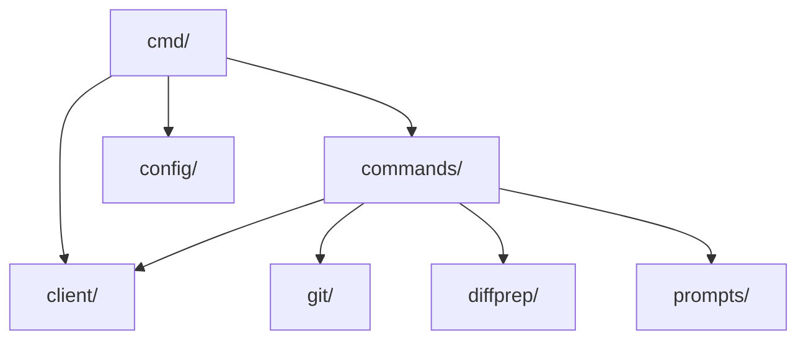
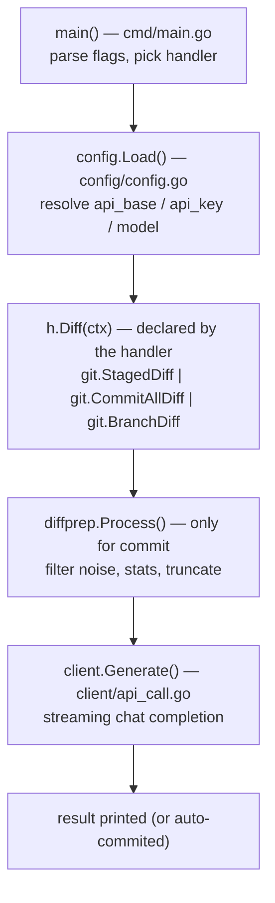
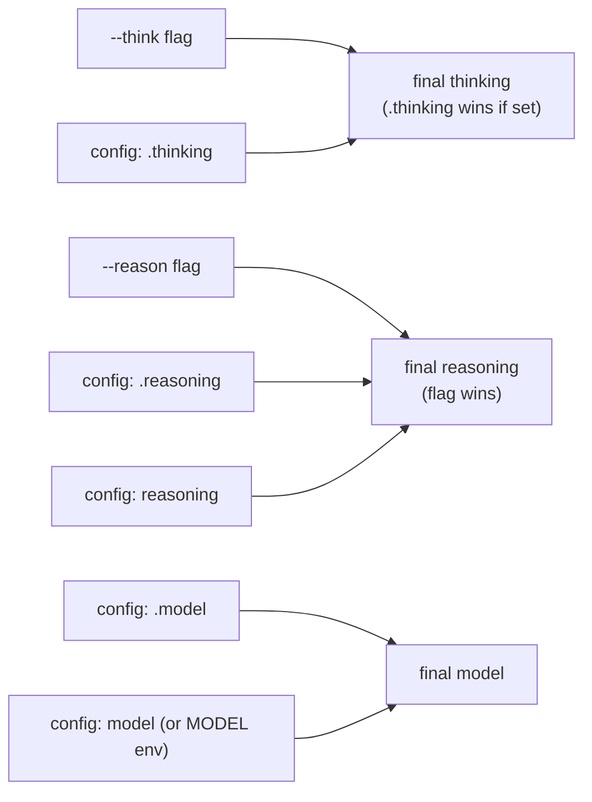

# Architecture

## Package layout

```
gitai/
├── cmd/          CLI entry point (flags, dispatch, output)
├── client/       OpenAI-compatible HTTP client
├── commands/     One feature per file (commit, review, pullreq, hook)
├── config/       Config file + env var resolution
├── git/          Git plumbing (diff sources, commit message sanitization)
├── diffprep/     Diff cleaning (filter, stats, truncate, chunk)
└── prompts/      Default system prompts + hot-reload loader
```

Each package has exactly one job, and the dependency direction is
strictly downward:



`client`, `git`, `diffprep`, and `prompts` know nothing about the CLI.
`diffprep` is pure (in string → out string), which is why it is the
easiest part of the codebase to reason about.

## End-to-end request flow

This is the whole program, from key press to result. Follow it top to
bottom; each node is the function to open.



Notes on the path:

- **Step C is where the task's data comes from.** Each handler decides
  its own diff source (see [extending.md](extending.md)). This is the
  only place behavior differs between tasks at the data level.
- **Step D only runs for commit.** Review and pullreq send the raw diff
  — a review needs exact lines, and a PR description covers a branch
  diff that was never "staged".
- **Step E may run multiple times** for large diffs (hierarchical
  summarization — see [commit-message.md](commit-message.md)).

## Model, thinking, and reasoning resolution

Done once in `cmd/main.go` after config loads, before any handler runs:



Priority, highest wins: per-task config → global config → environment.
Thinking: the `--think` flag seeds the value; a per-task
`<task>.thinking` overrides it when set. Reasoning: the `--reason`
flag wins; otherwise `<task>.reasoning`, then top-level `reasoning`,
then unset. Neither flag ever changes the model.

See [configuration.md](configuration.md) for the full rules.

## Failure behavior

- No API base or model configured → clear error at startup, nothing
  else runs (`config.Load`).
- Nothing to analyze (empty diff) → `run()` in `cmd/main.go` stops
  before any API call.
- API errors → surfaced with targeted hints from
  `client/api_call.go` (context-length, timeout, rate-limit wording).
