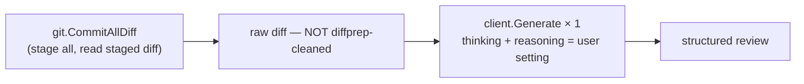

# Code Review

Command: `gitai -review`.

Handler: `commands/review.go` (`Review`).

## Flow



Two deliberate differences from the commit path:

1. **No diff preprocessing.** A review must point at real lines, so the
   raw diff is sent as-is. Filtering lock files or truncating hunks
   could hide the exact problem the review should find.
2. **No chunking.** Reviews of branch-sized diffs are out of scope;
   the single-call design is a known boundary, not an oversight.

## Output format

The system prompt (`prompts/review.go`) forces a fixed structure so
reviews are consistent run-to-run and parseable:

```
REVIEW: ACCEPTED | REJECTED

SECURITY:   - findings with severity (CRITICAL / HIGH / MEDIUM)
QUALITY:    - findings
BEST PRACTICES: - findings
SUMMARY:    - one-line verdict (safe to merge / needs fixes)
```

The three review axes are security (injection, secrets, traversal,
permissions), code quality (error handling, naming, validation), and
best practices (comments on complex logic, ignored errors, races,
leaks).
