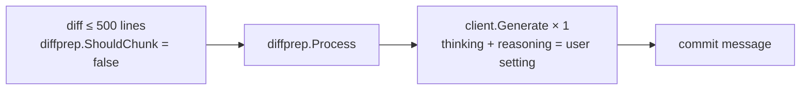
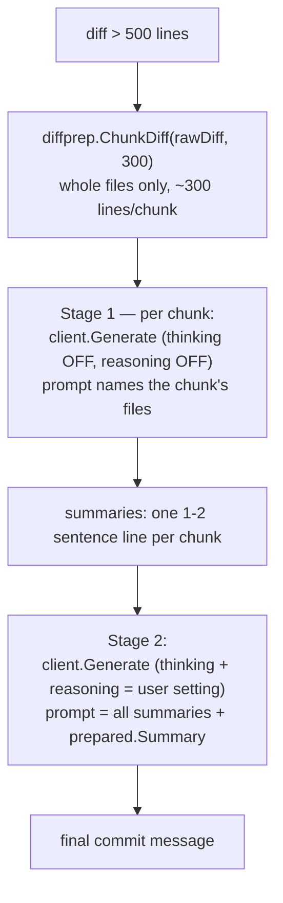

# Commit Message Generation

Commands: `gitai -commitmsg` (print) and `gitai -commit` (print + run
`git commit -m`).

Handler: `commands/commit.go` (`Commit`).

## Diff source

`Commit.Diff` → `git.CommitAllDiff`: stages the entire working tree
(`git add -A`), then reads the staged diff. Rationale: a commit message
should describe everything that will be committed, not just what you
happened to stage.

## Path 1 — small diff (single call)

The entire cleaned diff goes to the model in one request. Simple, fast,
and the model has full context.

## Path 2 — large diff (hierarchical summarization)

For big diffs, one request is either too big or too shallow. So
`Commit.runHierarchical` splits the work into two stages:

Design decisions, with reasons:

| Decision | Why |
|---|---|
| 300 lines/chunk | Small enough to fit comfortably in context, large enough that chunk count (and API call count) stays low |
| Whole files per chunk, never split | A fragment missing its header/hunks is harder to interpret than a slightly bigger whole file |
| Thinking + reasoning off in Stage 1 | Mechanical summarization × N chunks — thinking or an explicit strength would multiply latency/cost for no gain |
| `prepared.Summary` attached to Stage 2 | The model never saw the full diff, but it still learns the scale ("12 files, +800 -40") |
| Fail fast on any Stage-1 error | A partial summary set would silently produce a worse message |

**Muse Glimmer caveat.** Muse reasons on every call — the strength line
tunes depth, it does not switch reasoning off, and Stage-1 chunk
summarization cannot opt out of it. For very large diffs the only
mitigation is `-reason low` (shorter CoT per chunk). To keep the CoT
out of the Stage-1 summaries entirely, serve muse with
`--reasoning-parser muse_glimmer` so the private turns land in
`reasoning_content` and never in the text gitai reads — see
[reasoning.md](reasoning.md).

## Output handling

`cmd/main.go` takes the raw model text through `sanitizeForGit`
(strips control characters, caps at 7200 chars) before either printing
or passing it to `git commit -m`.
