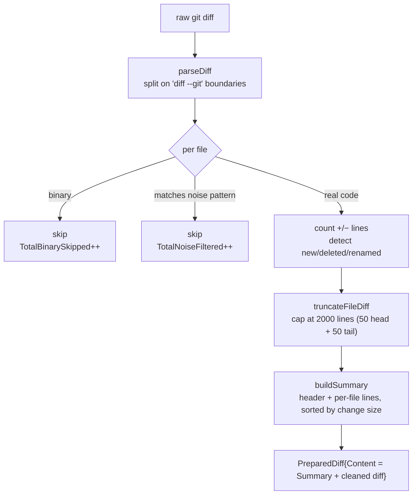

# Diff Preprocessing

Package: `diffprep/` — pure functions, in string → out string. No I/O,
no git, no network. This is what makes it trivially testable and safe.

Used by: the commit path only (see [commit-message.md](commit-message.md)).

## Pipeline

## Why each stage exists

| Stage | Function | Why |
|---|---|---|
| Noise filter | `isNoiseFile` against `NoisePatterns` | Lock files, build output, and generated code dominate real diffs. They burn context and poison output ("updated package-lock.json" in a commit message is noise). Patterns are deliberately conservative — a false keep is recoverable, a false exclude is not |
| Binary skip | `isBinary` | Binary files have no textual diff; counting their "lines" is meaningless |
| Per-file stats | `parseFileChunk` + `scanDiff` | Status (new/deleted/renamed) and +/- counts feed the summary header. `scanDiff` skips `+++`/`---` header lines so counts aren't off by two |
| Truncation | `truncateFileDiff` | One pathological file must not eat the whole context budget. Keeps 50 head lines (headers, first hunks) + 50 tail lines, elides the middle with a visible marker |
| Summary | `buildSummary` | Cheap orientation block ("3 files, +120 -40", files sorted by change size). Costs almost no tokens but tells the model what it is looking at |

## Chunking (large-diff support)

- **500 lines** is where a single call starts risking context overflow
  or lost focus.
- **Whole files only** — a file is never split across chunks; a partial
  diff is harder to read than a slightly larger whole one.
- A file bigger than the chunk budget gets its own chunk; per-file
  truncation is applied separately by `Process`.

## Key types

| Type | Where | Role |
|---|---|---|
| `FileStats` | `diffprep/preprocess.go` | Per-file metadata (status flags, +/- counts, raw chunk) |
| `PreparedDiff` | `diffprep/preprocess.go` | Final result: surviving files, totals, `Summary`, `Content` |
| `NoisePatterns` | `diffprep/preprocess.go` | The regex list; extend it here to filter more file types |
