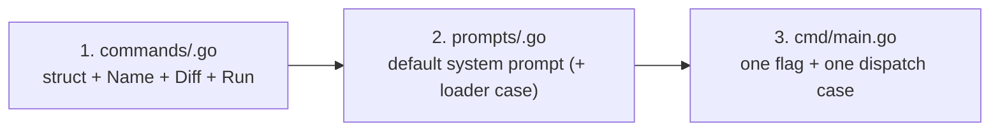

# Adding a New Feature

The structure is built so a new feature touches exactly three places:



Nothing else changes. Config, client, and diff prep are all reused as-is.

## Step 1 — the handler

Create `commands/<feature>.go`:

```go
type MyFeature struct {
    // any task-specific input, e.g. a branch name
}

func (f *MyFeature) Name() string { return "myfeature" }
```

`Name()` is load-bearing, not decorative — it is the key for
`<task>.model`, `<task>.thinking`, and the `system_prompts/<task>.md`
override. Name it accordingly.

```go
// Choose the diff source from the git package:
//   git.StagedDiff(ctx)      — staged only, no side effects
//   git.CommitAllDiff(ctx)   — stage everything, then read staged diff
//   git.BranchDiff(ctx, x)   — whole branch vs base
func (f *MyFeature) Diff(ctx context.Context) (string, error) { ... }
```

Pick `StagedDiff` (never `CommitAllDiff`) if the feature will ever run
from a git hook or anywhere the user's index must stay untouched.

```go
func (f *MyFeature) Run(ctx context.Context, cli *client.Client,
    diff string, model string, thinking bool, configDir string) (string, error) {
    systemPrompt := prompts.LoadSystemPrompt("myfeature", configDir)
    prompt := fmt.Sprintf("Do the thing:\n\n%s", diff)
    return cli.Generate(ctx, prompt, systemPrompt, model, thinking)
}
```

## Step 2 — the prompt

Add a `DefaultMyFeatureSystem()` to `prompts/` and register it in
`prompts.LoadSystemPrompt`'s fallback switch. Users can then override it
via `~/.gitai/system_prompts/myfeature.md` with no code change.

## Step 3 — the flag

In `cmd/main.go`: one `flag.Bool` and one `case` in the dispatch switch:

```go
myFeatureFlag := flag.Bool("myfeature", false, "...")
// ...
case *myFeatureFlag:
    handler = &commands.MyFeature{}
```

Done. The shared pipeline in `run()` (diff → empty check → execute →
print), config resolution, timeouts, and error handling all apply
automatically.

## Checklist

- [ ] `Name()` returns the task key used in config and prompts
- [ ] `Diff()` picks a diff source with the right side-effect profile
- [ ] Default prompt registered in the loader switch
- [ ] Flag added and documented in `flag.Usage`
- [ ] `go build ./... && go vet ./...` pass
