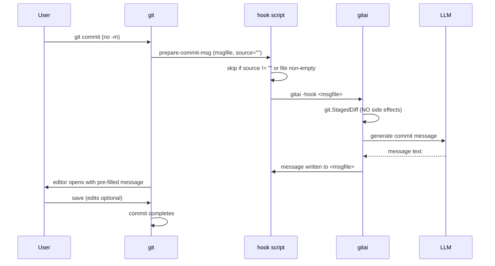

# Design: `prepare-commit-msg` Hook

Status: **planned** — structure work is done, feature not yet implemented.

## Goal

Type `git commit` (no `-m`) and your editor opens with an
AI-generated commit message already in the file. Tweak it if you want,
save, and the commit proceeds. No new command in the user's muscle
memory; the feature is invisible until they use it.

## How git hooks fit

Git runs `.git/hooks/prepare-commit-msg` right before opening the
commit message editor, with:

| Arg | Meaning |
|---|---|
| `$1` | Path to the commit message file (e.g. `.git/COMMIT_EDITMSG`) |
| `$2` | Source: `message`, `template`, `merge`, `copy` — **empty for a plain `git commit`** |
| `$3` | SHA (only when committing an amend) |

The hook must **only act when `$2` is empty** — that is the one case
where the user typed `git commit` with no message and no `-m`.

## Flow

## Critical constraint: no side effects on the index

At hook time the user may have **deliberately staged a subset** of
their changes. The shared commit path uses
`git.CommitAllDiff` (which runs `git add -A`) — that is exactly wrong
inside a hook. The hook must use `git.StagedDiff`
(`git/git.go`), which reads the staged diff without touching the index.

This is the specific reason `git.StagedDiff` exists in the codebase
today even though no caller uses it yet.

## Implementation sketch

| Piece | Shape |
|---|---|
| `gitai -install-hook` | New flag: writes a small shell script to `.git/hooks/prepare-commit-msg`, `chmod +x`, per repository |
| Hook script | `[ -n "$2" ] && exit 0; [ -s "$1" ] && exit 0; gitai -hook "$1" 2>/dev/null \|\| exit 0` — failures must never block a commit |
| `gitai -hook <file>` | New mode: `Commit` handler + `git.StagedDiff` + write result to the file instead of stdout (no decorative banners, no auto-commit) |
| Empty staged diff | Hook exits silently — normal `git commit` flow continues |

## Safety properties

- Never modifies the index or working tree.
- Never blocks a commit: any error (no API, no model, no staged
  changes) → exit 0, git proceeds normally.
- Never overwrites: only fills an empty message file from an empty
  source.
- User always sees the message in their editor before it is committed.
