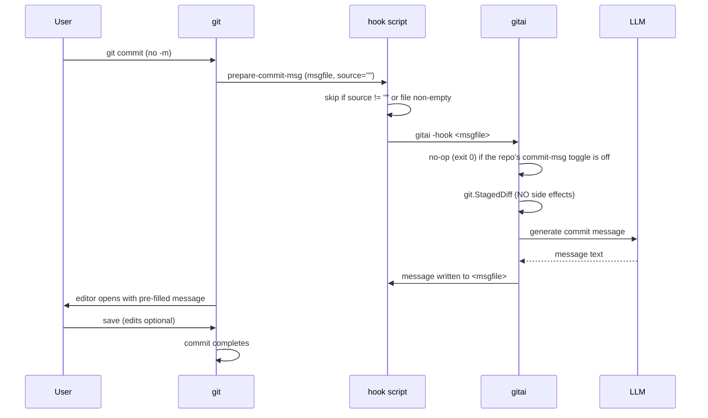

# Design: `prepare-commit-msg` Hook

Status: **implemented** (see the "Implementation" section at the bottom for
how the built version maps onto this design).

## Goal

Type `git commit` (no `-m`) and your editor opens with an
AI-generated commit message already in the file. Tweak it if you want,
save, and the commit proceeds. No new command in the user's muscle
memory; the feature is invisible until they use it.

The feature is **opt-in per repo**: installing the hook is separate from
enabling AI commit messages for a repo. A repo opts in with
`gitai -commitmsg-on` and back out with `gitai -commitmsg-off`, so the
same installed hook serves every repo while each repo decides for itself
whether commit messages use AI. This keeps the hook as shared
infrastructure and reserves room for future hook features, each with its
own per-repo toggle.

## How git hooks fit

Git runs `.git/hooks/prepare-commit-msg` right before opening the
commit message editor, with:

| Arg | Meaning |
|---|---|
| `$1` | Path to the commit message file (e.g. `.git/COMMIT_EDITMSG`) |
| `$2` | Source: `message`, `template`, `merge`, `copy` — **empty for a plain `git commit`** |
| `$3` | SHA (only when committing an amend) |

The hook must **only act when `$2` is empty** — that is the one case
where the user typed `git commit` with no message and no `-m`.

## Flow

## Critical constraint: no side effects on the index

At hook time the user may have **deliberately staged a subset** of
their changes. The shared commit path uses
`git.CommitAllDiff` (which runs `git add -A`) — that is exactly wrong
inside a hook. The hook must use `git.StagedDiff`
(`git/git.go`), which reads the staged diff without touching the index.

This is the specific reason `git.StagedDiff` exists in the codebase
today even though no caller uses it yet.

## Implementation sketch

| Piece | Shape |
|---|---|
| `gitai -install-hook` | New flag: writes a small shell script to `.git/hooks/prepare-commit-msg`, `chmod +x`, per repository |
| Hook script | `[ -n "$2" ] && exit 0; [ -s "$1" ] && exit 0; gitai -hook "$1" 2>/dev/null \|\| exit 0` — failures must never block a commit |
| `gitai -hook <file>` | New mode: `Commit` handler + `git.StagedDiff` + write result to the file instead of stdout (no decorative banners, no auto-commit) |
| Per-repo toggle | `gitai -commitmsg-on` / `-commitmsg-off` write or remove the marker file `<git-dir>/gitai/commitmsg`; `-hook` exits 0 when the marker is absent |
| Empty staged diff | Hook exits silently — normal `git commit` flow continues |

## Safety properties

- Never modifies the index or working tree.
- Off by default: a repo gets no AI prefill until `gitai -commitmsg-on`
  is run in it; the state is a per-repo marker in the repo's `.git/`,
  not git config.
- Never blocks a commit: any error (no API, no model, no staged
  changes) → exit 0, git proceeds normally.
- Never overwrites: only fills a message file that holds no real
  (non-comment) content, from an empty source. Git's own default `#`
  comment block does not count as content.
- User always sees the message in their editor before it is committed.

## Implementation (as built)

| Piece | Where | Notes |
|---|---|---|
| `gitai -install-hook` | `cmd/install_hook.go` | Resolves the git dir via `git rev-parse --git-dir` (works from subdirs); embeds the **absolute** gitai path (`os.Executable`) in the script so it survives `$PATH` changes; backs up an existing `prepare-commit-msg` to `.bak` (a pre-existing `.bak` is **kept**, never clobbered — it may hold a hand-written hook); `chmod 0755`; warns when `core.hooksPath` is set, since that shadows `.git/hooks`. Early-returns in `main` before `config.Load` — installing needs no API. |
| `gitai -hook <file>` | `commands/hook.go` + `cmd/main.go` | `Hook` embeds `Commit` and overrides only `Diff` → `git.StagedDiff`. `Run` (prompt, `diffprep`, generate) is promoted from `Commit` unchanged. `main` writes `git.SanitizeCommitMessage(result)` into `<file>` and exits 0 on every path — error, success, or clean tree. Dispatch checks `-hook` before the task flags, so it can never fall back to `Commit` (whose `git add -A` would run mid-commit); config-load errors and invalid `reasoning` values also resolve to exit 0 (the value is dropped, generation proceeds). |
| Per-repo toggle | `cmd/hook_toggle.go` + `cmd/main.go` | `gitai -commitmsg-on`/`-commitmsg-off` write or remove `<git-dir>/gitai/commitmsg` via the shared `gitDirPath()` helper (presence = ON; both are idempotent and error outside a repo). The `-hook` path exits 0 before generating when the marker is absent, so an un-opted-in repo never reaches the API. Default is OFF; `gitai -install-hook` tells the user how to opt in. Tests: `cmd/hook_toggle_test.go`. |
| Config | `hook.*` keys | `Name()=="hook"` makes the generic per-task resolution in `main` treat it like any other task (`hook.model`, `hook.thinking`, `hook.reasoning`), falling back to the global model. |
| Tests | `cmd/install_hook_test.go`, `commands/hook_test.go` | Script guards + resolved path are asserted; `TestHookScriptBailGuards` executes the actual script (fake gitai) against comment-only, empty, real-content, and source-set files; `Hook` is checked to satisfy `Handler` (compile-time) and to report `Name()=="hook"`. |
| Script guard | `cmd/install_hook.go` (`hookScript`) | Bail when `$2` (source) is set, or when the message file already holds a real (non-comment) line. The subtlety: git writes its default `#` comment block into the file **before** running the hook, so the file is never empty at hook time — the guard therefore greps for real content (`grep -qEv '^[[:space:]]*(#|$)'`) instead of testing non-emptiness. The original `[ -s "$1" ]` guard bailed on every real `git commit`; `TestHookScriptBailGuards` is the regression pin. |

Deliberate deviations from the sketch above: the script embeds the
absolute binary path rather than bare `gitai`, an existing hook is
backed up to `.bak` rather than overwritten silently (and a pre-existing
`.bak` is kept on re-install), and install warns when `core.hooksPath`
is set. All small robustness wins that don't change the flow.

When the per-repo toggle landed, the installed hook script itself was
**not** changed: it stays shared infrastructure (the two shell bail
guards plus calling `gitai -hook`), and the on/off decision happens
inside `gitai -hook`, which reads the marker via the repo's git dir.
That keeps the script's safety guards the only logic that runs at
commit time, and leaves room for future hook features to each read
their own marker without touching the script.

One deliberate script change: the early version ran
`gitai -hook ... 2>/dev/null`. git keeps the hook's stderr attached to
the user's terminal, so that redirect swallowed the live spinner and
the `gitai hook:` warnings — a slow model looked frozen again. The
script now leaves stderr attached; gitai already degrades to a single
static line when stderr is not a TTY, so piped/CI runs stay clean.
