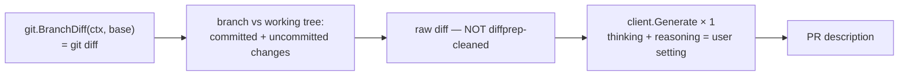

# PR Description Generation

Commands: `gitai -pullreq` (alias `-pr`), with optional
`-branch <base>` (default `main`).

Handler: `commands/pullreq.go` (`PullReq`).

## Diff source — why it differs from commit/review

A PR description must describe everything the PR will contain, and most
of that is **already committed** to the branch. Staging only uncommitted
changes would describe the wrong thing. So:



`git diff <base>` compares the base branch's commit against the current
working tree, so it covers committed and uncommitted changes in one
diff. The base branch is carried on the handler itself
(`PullReq.Base`, set from the `-branch` flag in `cmd/main.go`).

## Output format

The system prompt (`prompts/pullreq.go`) fixes four sections, in the
order a reviewer looks for them:

```
## Summary        — what and why, 1-2 sentences
## Changes        — bulleted, grouped by feature/area
## Testing        — how to verify
## Breaking Changes — or "None"
```
