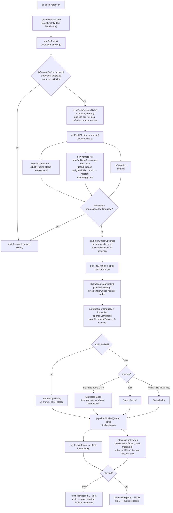

# The push pipeline (pre-push checks)

`gitai` can act as a **quality gate for `git push`**: before the refs reach
the remote, a check pipeline runs over **only the files in the push** —
one formatter and one linter per detected language, each step shown live
with the purple spinner. A blocking failure aborts the push with the
findings printed in the terminal; everything else pushes normally.

git itself is left exactly as-is: the pipeline is an installed
`pre-push` hook that `exec`s `gitai -pre-push`. No other git behavior
changes.

## Gate model (off by default, per repo)

Like AI commit messages, push checks are a **per-repo opt-in** managed by
gitai, not by git config:

| Command | Effect |
|---|---|
| `gitai hook install` | Installs **both** hooks (`prepare-commit-msg` + `pre-push`), each backed up to `.bak` if present |
| `gitai push-check enable` | Creates the marker `<git-dir>/gitai/pushcheck` — the next `git push` runs the pipeline |
| `gitai push-check disable` | Removes the marker — pushes pass silently again |

The on/off state lives in the repo's `.git/`, so the installed hook stays
as shared infrastructure while each feature toggles per repo. A repo that
never enables the feature pays one cheap file-existence check per push.

## End-to-end flow



## What counts as "the files in the push"

`git.PushFiles` (git/push_files.go) is the only place that decides the
file list:

- **Existing remote ref** — `git diff --name-status <remote-sha> <local-sha>`:
  exactly what this push adds or changes.
- **New remote ref** (all-zero remote sha) — the diff is taken against the
  **merge-base with the default branch** (`newRefBase`, via
  `refs/remotes/<remote>/HEAD`, then `main`, then `master`), so a new
  branch is judged on what it adds over trunk, not on the whole history.
  If no trunk is resolvable, the diff falls back to the empty tree
  (every tracked file), so a new ref can never silently escape the checks.
- **Ref deletion** (all-zero local sha) — nothing to check.
- **Deleted files are excluded** everywhere: the parsers in
  `addFiles` drop `D` entries from the name-status output, because the
  check tools read files from the working tree and a removed file cannot
  be read. (Renames/copies report their destination path.)
- Multiple refs in one push are unioned and deduped.

Consequences worth knowing:

- **First push of the default branch** (e.g. `git push -u origin main` on
  a fresh repo): the merge-base of `main` with itself is `main`, so the
  diff is empty → nothing is checked → the push passes. This is
  deliberate: checking an entire new repository could be thousands of
  files and would trap the very first push.
- **`go.mod`-only pushes, README-only pushes, ...** — no supported
  language detected → the pipeline runs zero steps and exits 0 without
  printing a report.
- **Force pushes and tag pushes** run through the same diff logic (the
  pre-push hook always receives the remote's current value as the base).

## Steps, statuses, and blocking

`pipeline.Run` (pipeline/run.go) walks the detected languages in a fixed
order (go, python, node, shell, html, yaml — `pipeline/detect.go`) and
runs a **format step then a lint step** per language. Each step:

1. Checks the config toggle (`format` / `lint` — off ⇒ `StatusSkipDisabled`).
2. Resolves the tool (built-in default, or a `pushchecks.tools` override;
   the built-in tool's failure semantics survive an override).
3. Looks the binary up on `PATH` (missing ⇒ `StatusSkipMissing`, warn and
   skip — **never blocks**).
4. Starts the purple spinner with a per-step label
   (`Formatting go with gofmt`, `Linting go with golangci-lint`, ...),
   runs the tool with a **5-minute cap** (`exec.CommandContext`).

| Status | Meaning | Blocks the push? |
|---|---|---|
| `pass` | tool ran clean | no |
| `fail` | real findings / format problem | format: **always** · lint: only at the threshold |
| `skip-missing` | tool not installed | no |
| `skip-disabled` | step switched off in config | no (not even reported) |
| `tool-error` | linter exited non-zero **without naming any file** (bad config, Go-version mismatch, ...) | no — shown with its output |

The `tool-error` status exists because a crashed linter must not be
counted as "one file with findings": on a two-file push that fabricated
finding would hit the 50% threshold and block the push over a tooling
problem the user cannot see.

### Lint threshold

`LintBlocked(affected, total, threshold)` (pipeline/run.go) blocks when
`affected/total ≥ threshold%`. `affected` is the number of **distinct
files** the linter output names
(`AffectedFiles` scans for path tokens carrying the language's extension
— `main.go:12:3: ...` — a tolerant token scan that works across
golangci-lint, ruff, eslint, shellcheck, and yamllint output styles).

- Default threshold: **50** — half or more of the checked files must have
  findings before the push is blocked; below that the report shows
  "Push allowed: lint findings below the 50% threshold."
- `threshold: 0` — **any** finding blocks.
- Format failures have no threshold: an unformatted file blocks
  immediately (the spec: only push once format is clean).

### Per-language default tools

| Language (extensions) | Formatter | Linter |
|---|---|---|
| go (`.go`) | `gofmt -l` (FailOnOut: exit 0, prints filenames) | `golangci-lint run` |
| python (`.py`) | `black --check --quiet` | `ruff check` |
| node (`.js .jsx .ts .tsx .mjs .cjs`) | `prettier --check` | `eslint` |
| shell (`.sh .bash`) | `shfmt -d` (FailOnOut) | `shellcheck` |
| html (`.html .htm`) | `prettier --check` | `htmlhint` |
| yaml (`.yml .yaml`) | `prettier --check` | `yamllint` |

`gofmt` and `shfmt` are listers: they exit 0 and print the offending
files, so their registry entries carry `FailOnOut` — non-empty output
means failure regardless of exit code.

### Per-directory linters

golangci-lint's "named files" mode type-checks a **single package**, so one
call naming files from two different directories aborts before linting
anything:

```
level=error msg="typechecking error: named files must all be in one directory"
```

Left unhandled, that abort is a non-zero exit naming no file, so the step
would degrade to a `tool-error` skip and a multi-directory push would never
be linted at all. The registry therefore marks such a tool with
`PerDirectory` (currently only `golangci-lint`), and `runStep` groups the
pushed files by directory (`groupFilesByDir`) and runs the tool **once per
directory**, concatenating the output. Each per-directory run shares the
step's 5-minute budget, and findings are counted across the combined
output — so the threshold math and the tool-error guard are unchanged.

## Configuration

All knobs live in the `pushchecks` block of `~/.gitai/gitai.json`
(read by `loadPushCheckOptions`, which falls back to defaults when the
config is missing or broken — a broken config never blocks a push):

```json
{
  "pushchecks": {
    "threshold": 50,
    "format": true,
    "lint": true,
    "tools": {
      "go": { "lint": "golangci-lint run --fast {files}" },
      "python": { "format": "ruff format --check {files}" }
    }
  }
}
```

- `threshold` — percentage of checked files with findings at which the
  push blocks (`0` = any finding blocks).
- `format` / `lint` — kill whole step classes.
- `tools.<lang>.<kind>` — override a whole command line; the first field
  is the executable looked up on `PATH`, `{files}` is replaced by the
  file list (when omitted, the files are appended). The built-in
  tool's `FailOnOut` semantics survive the override.

## Safety guarantees

The pipeline is a quality gate, not a hard dependency. The push is
blocked **only** by real check failures:

- gitai crashing, panicking, or misconfiguring → exit 0, push proceeds.
- git plumbing surprises in `PushFiles` (unresolvable base, ...) → that
  ref is skipped, never fatal.
- Missing tools → warn and skip.
- Linter tooling errors (no file named in the output) → shown, never
  counted as findings.
- A hung tool is capped at 5 minutes per step.

## Limitations (known, v1)

- Files beyond the six registered language families are ignored.
- Very large pushes (tens of thousands of files) are passed to the tools
  as one argument list; extreme sizes can hit OS argument limits, and a
  single step is capped at 5 minutes.
- The first push of the default branch checks nothing (see above).

## Tests

- `cmd/push_check_test.go` — ref-line parsing (existing / new / deletion),
  remote-name resolution, output capping.
- `git/push_files_test.go` — file-list semantics on real temp repos:
  existing ref, ref deletion, new ref (merge-base), union dedupe,
  deleted-file exclusion.
- `pipeline/detect_test.go` — language detection order, dedupe, unknowns,
  case-insensitivity.
- `pipeline/run_test.go` — threshold table, affected-file counting per
  tool output style, tool-error path, missing-tool skip, disabled steps,
  `FailOnOut` contract, per-directory grouping (`groupFilesByDir`) and
  per-directory execution (`runPerDirectory`), and a full fake-tool
  end-to-end run.
- `cmd/hook_toggle_test.go` — per-repo marker on/off, idempotency, and
  independence of the two feature markers.
