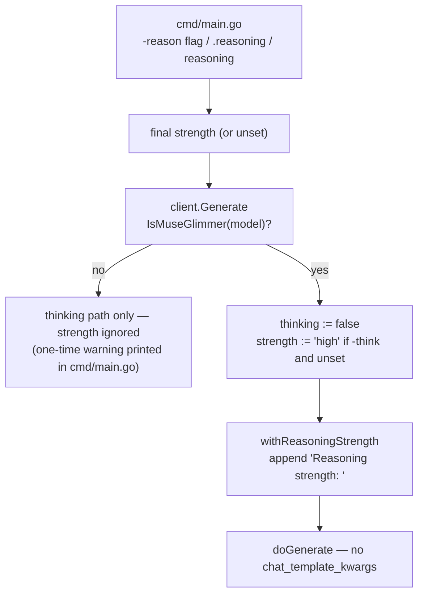

# Reasoning Mode (Muse Glimmer)

Flag: `-reason low|medium|high|xhigh` (any task).
Code: `client/reasoning.go` (model match + injection),
`client/api_call.go` (`Generate`), `cmd/main.go` (flag + resolution).

## What Muse Glimmer does differently

Muse Glimmer (Meta, 30B) is an **always-on** reasoning model: it writes a
private chain of thought in `to=self` assistant turns, and only in the
`to=user` turn does it produce the visible answer. It **cannot be
switched off**. Specifically, two knobs people expect to work do not:

- `chat_template_kwargs.enable_thinking` — what `-think` sends; the
  Muse Glimmer chat template never reads it.
- Top-level `reasoning_effort` — also never read.

The one real control is **how much** it reasons: a *reasoning strength*
of `low / medium / high / xhigh` (default `high`).

## How gitai applies the strength

`Generate` (`client/api_call.go`) detects the model **per call** —
`IsMuseGlimmer` (`client/reasoning.go`), a case-insensitive substring
match on `muse-glimmer`, so `muse-glimmer:30b`, `Meta/Muse-Glimmer-30B`,
etc. all match. Per call rather than per client because per-task model
overrides can change the model mid-run. For muse it then:

1. Forces `thinking = false` — `enable_thinking` is never sent (a dead
   kwarg on a strict server could be rejected outright), and the
   thinking-fallback retry gate in `Generate` can no longer fire for
   muse — its errors surface directly instead of burning a second call.
2. Appends `Reasoning strength: <level>` to the system prompt
   (`withReasoningStrength`). This is the mechanism Meta's own serving
   docs prescribe, and it works on **any** OpenAI-compatible server
   (vLLM, llama.cpp, Ollama, LiteLLM). The alternative — the
   `chat_template_kwargs.reasoning_strength` jinja variable — only
   reaches the template on vLLM-family servers; gitai stays
   provider-agnostic, so the prompt line wins.
3. `-think` with no explicit strength maps to `high` — the user asked
   for extra thinking; muse's answer to "how much" is its default.

Duplicate guard: if the system prompt already contains a
`Reasoning strength:` line (case-insensitive) — e.g. in a custom
`~/.gitai/system_prompts/commit.md` — nothing is appended; the user's
line wins. The line is appended, not prepended, so a hot-reloaded custom
prompt still diffs cleanly.

## Precedence

Resolved once in `cmd/main.go` before any handler runs:

| Highest → lowest | Source |
|---|---|
| 1 | `--reason` flag |
| 2 | `<task>.reasoning` in `~/.gitai/gitai.json` |
| 3 | top-level `reasoning` in the config file |
| 4 | unset (muse runs at its own default, `high`) |

Invalid values exit with an error naming the allowed set. A strength
set against a **non-muse** model prints a one-time stderr warning and is
ignored — `withReasoningStrength` is only ever called for muse, so no
meaningless line reaches any other model's prompt. The notice lives in
`cmd/main.go`, not the client, because `Generate` runs N+1 times in
hierarchical mode and must not repeat it.

## Where the CoT goes (and why it cannot leak)

When the server runs with `--reasoning-parser muse_glimmer` (vLLM), the
`to=self` turn is routed to a separate `reasoning` / `reasoning_content`
field on each streamed chunk. gitai's SSE reader (`doStreamedRequest`,
`client/api_call.go`) accumulates only `delta.content`, so the CoT never
enters the printed output, the commit message, or the review.

Without that parser flag, raw `to=self` markers can land in `content`.
That is a server-side configuration gap, not a gitai bug — but on the
commit path it matters more: CoT contaminated in a stage-1 chunk summary
propagates into the stage-2 synthesis. Recommended vLLM flags:

```
--tool-call-parser muse_glimmer --reasoning-parser muse_glimmer --generation-config auto
```

with the model's recommended sampling (temperature 1.0, top_p 0.95,
top_k 64 — not greedy).

## Hierarchical commit path

- Stage-1 chunk summarization sends reasoning `""` (mirrors the
  thinking-off choice): mechanical work × N chunks, no strength needed.
- Stage-2 synthesis honors the user's strength.
- Caveat: muse reasons on **every** call regardless — the strength line
  tunes depth, it does not switch reasoning off. For very large diffs
  the only mitigation is `-reason low` (shorter CoT per chunk).

## Flow


